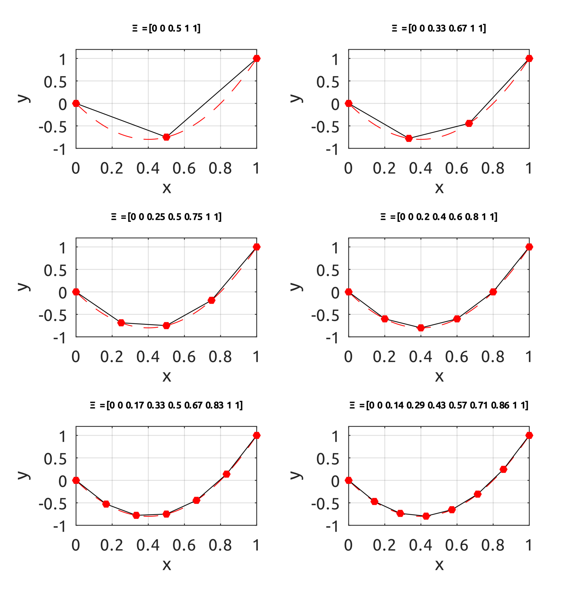
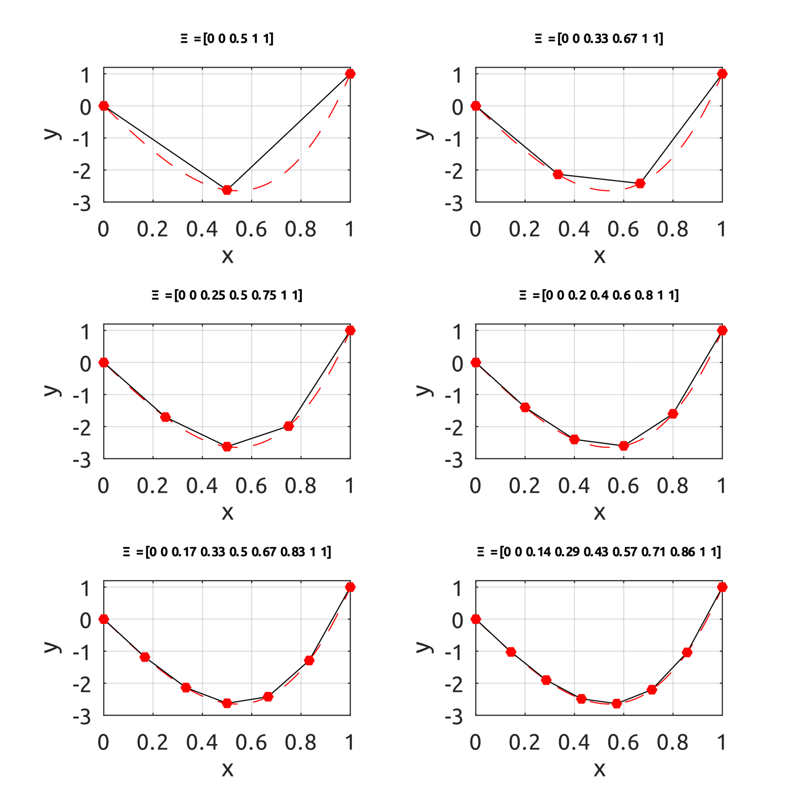
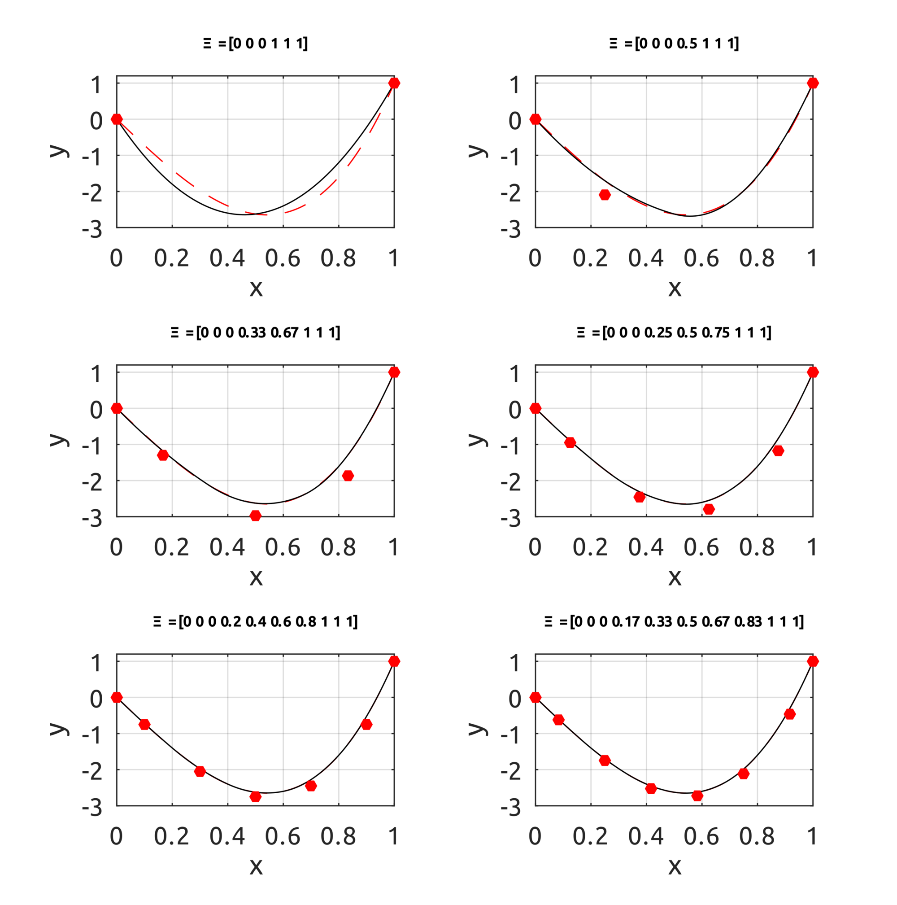
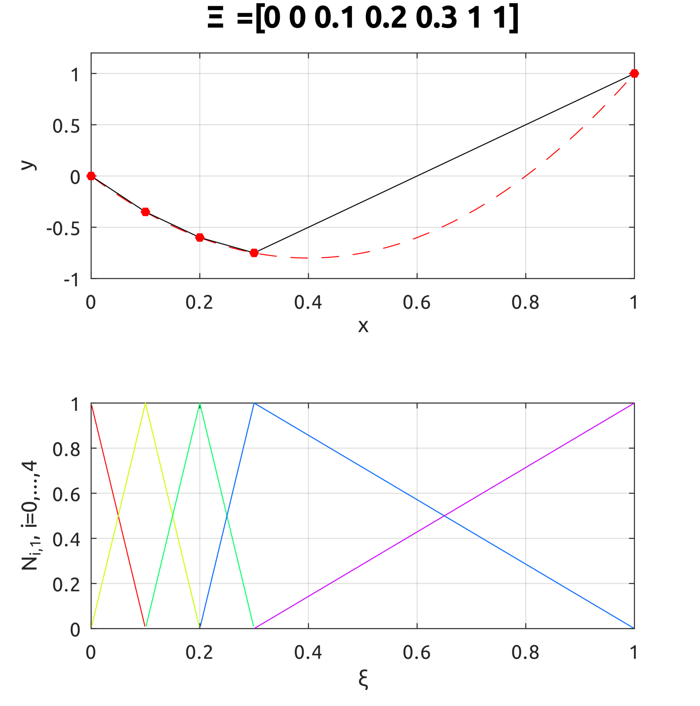

### drawIGA1DExample

This script is an example of how to use IGA to approximate the solution of the PDE problem:

    u''(x) = 10
    u(0) = 0
    u(1) = 1

with increasing number of knots. Knot insertion results in finer mesh, converging to the exact solution (in red).

### drawIGA1DExample2

The second script solves the problem:

    1/50*u''(x) = x
    u(0) = 0
    u(1) = 1

using IGA, with know insertion.

### drawIGA1DExample3

The third script solved the problem:

    1/50*u''(x) = x
    u(0) = 0
    u(1) = 1

using degree 2 b-spline basis functions.

### drawIGABasisFuns

This script shows how knot insertion can affect the precision of the estimation.

### drawNURBSCircleKnotInsertion

Know insertion for NURBS circle.

### drawNURBSPlateHoleKnotInsertion

Knot insertion on a plate with a hole.

